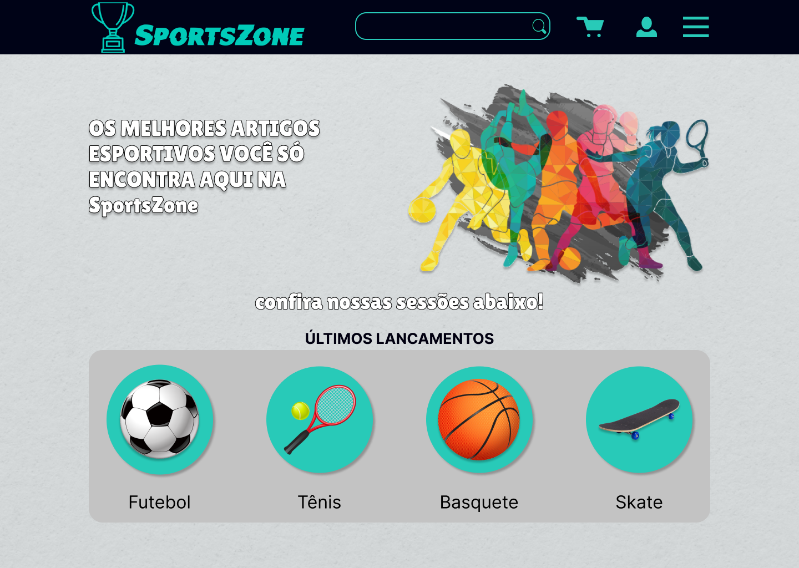
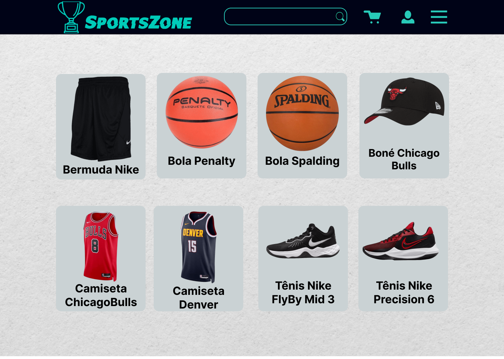
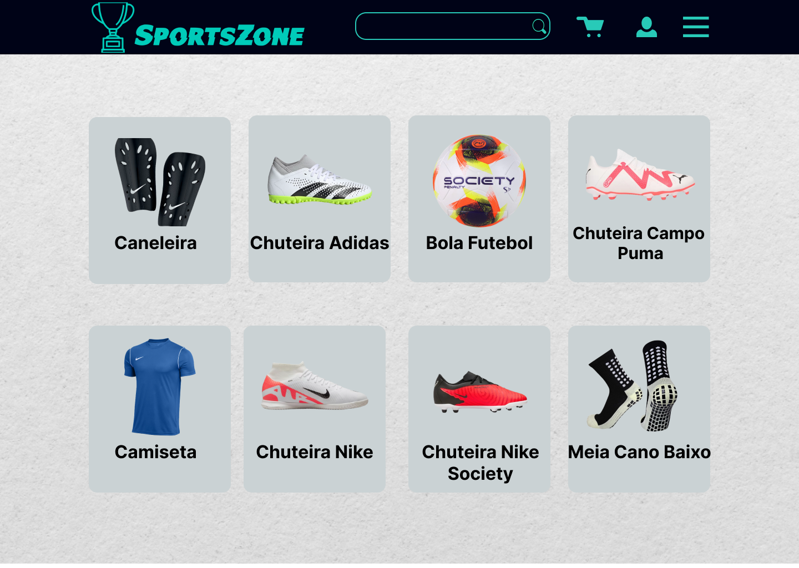
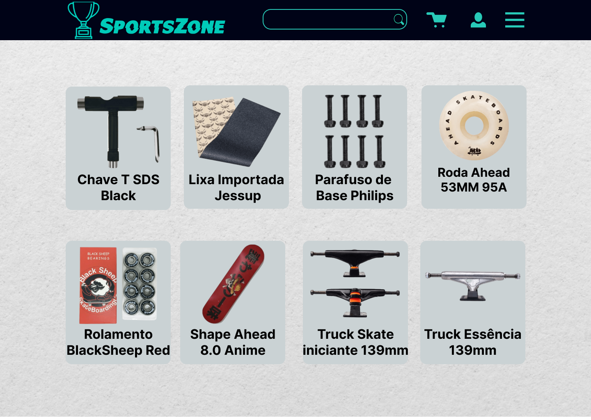
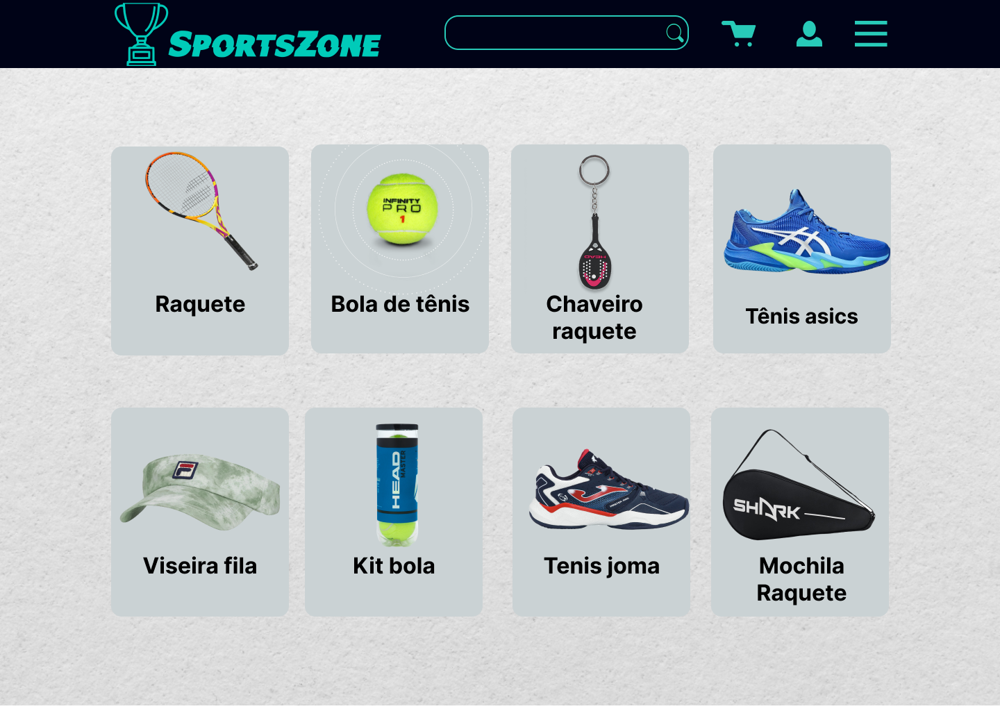

# SportsZone
Trabalho da faculdade  (Fatec Franca - Curso DSM) - Loja de Artigos esportivos

# Integrantes do Grupo

## Inácio Santana

## Jonathan Dias

## Rafael Gomes

## Vinicius de Paula

# Linguagens usadas

CSS e Html

# Prototipação no figma
 
## Pagina Principal

## Pagina de login

## Pagina de produtos

## Pagina de carrinho

# Link do site

## <a href="https://sportszone-fatec.netlify.app">Sportszone</a>
